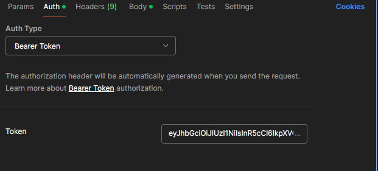

En este proyecto hay muchas peticiones http que debemos de realizar. Vamos a suponer que tenemos el servidor corriendo en el puerto 4000:

# Peticiones Http:

### Seed:

Datos a cargar (Paises, Idiomas, Industrias, Tipo de contratos, etc.)

#### Metodo: GET

```
http://localhost:4000/seed
```

## Registro:

```
localhost:4000/api/auth/signup
```

Los roles posibles son: student, recruiter, inversor, admin, y superAdmin. Dependiendo del rol, tendremos distintas peticiones que estarán restringidas.

## Cuerpo de la petición:

```
{
    "name": "Admin",
    "surname": "User",
    "email": "admin123@gmail.com",
    "password": "123456789",
    "about": "Esto es una descripción de un Admin",
    "roleName": "admin"
}
```

## Inicio de sesión

```
localhost:4000/api/auth/signin
```

# Importante: 
Hay muchas peticiones que estan protegidas, es decir, que necesitan de una autenticación por parte del usuario y saber su tipo de rol. Cuando iniciemos sesión o nos registremos, la respuesta será un token que, el cual tendra la información necesaria para que nosotros podamos hacer peticiones especiales.

**El token debe de ir en el apartado de Authentication, con el tipo Bearer Token**



### Cuerpo de la petición:

```
{
    "email": "admin123@gmail.com",
    "password": "123456789"
}
```

# Con un Token de usuario Recruiter:

### Lista de compañias/compañias

```
localhost:4000/api/company/list
```

### Busqueda individual usando el id de la compañia

```
localhost:4000/api/company/:id
```

### Creación de una compañia.

```
localhost:4000/api/company/create
```

#### Cuerpo de la petición:

```
{
    "name": "Lays",
    "description": "Esto es una descripción",
    "industryId": 1,
    "address":"Direccion 123",
    "cantEmployees": 100,
    "justification": "Justificación"
}
```

### Crear una asociación de una compañia:

```
localhost:4000/api/associations/uuid-de-una-compañia/create
```

### Crear una oferta de trabajo:

```
localhost:4000/api/jobs-offer/uuid-de-la-compañia/create
```

### Cuerpo de la petición:

```
{
    "title": "Trabajo 1",
    "description": "Esto es una descripción"
}
```

# Con un Token de usuario Admin:


### Aceptar/Rechazar una compañia:

```
localhost:3000/api/company/update-status/uuid-de-la-compañia/rechazada
```

```
localhost:3000/api/company/update-status/uuid-de-la-compañia/aceptada
```
